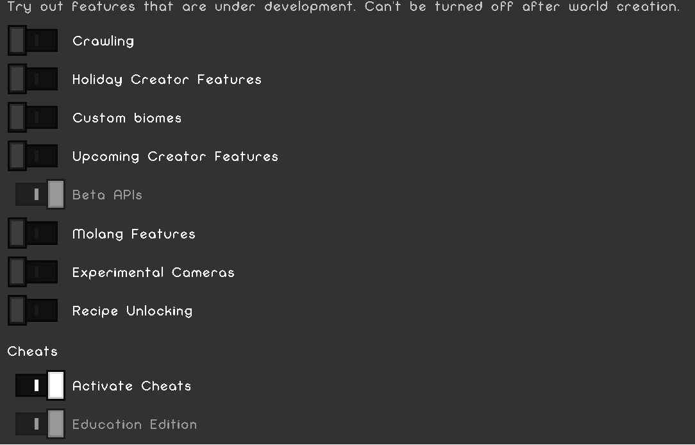

# How to install

**__Realms__**

Start off by downloading the world from your realm

Then, open up the worlds settings and click on

- [x] Beta-API

- [x] Education Edition




Then upload it to your realm and use that world!

Then, run this command ```/function op```


__**Server**__

Start off by opening your servers files

Then go into this directory:

```files/packs/behaviour_packs```

If the ```behaviour_packs``` folder doesnt exist, make it and add the anticheat file there

keep in mind the file extension must be a ```.zip``` not a ```.mcpack``` when applying it to a server